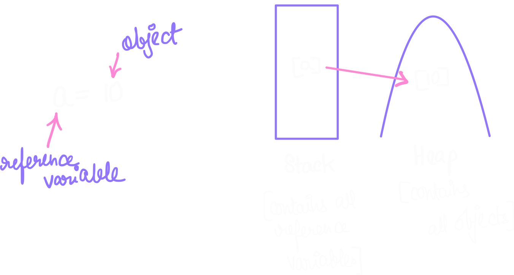
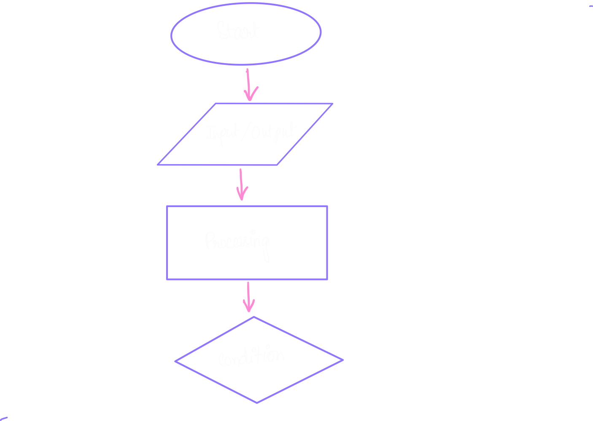

# Introduction to Programming

## Types of Languages:

### Procedural

1.  Specifies a series of well-structured steps and procedures to compose a program
2.  contains a systematic order of statements, functions and commands to complete a task

### Functional

1.  Writing a program only in pure functions i.e. Never modify variables, but only create new ones as an output.
2.  used in situations where we have to perform lots of different operations on the same set of data.
3.  They also first class functions (like reassigning functions).

### Object Oriented

1.  The main aim of OOP is bind together the data and the functions that can operate on them, so that on part of code can the data except that function

### Static

1.  Performs type checking at compile time
    
2.  Errors will be shown at compile time
    
3.  Declare Datatypes before you use it
    
4.  More Control
    
    E.g. int a = "name" { will give error }
    

### Dynamic

1.  Performs type checking at runtime.
2.  Errors is not shown until the program is run
3.  No need to declare datatypes of variables
4.  Saves time in writing code but might give error at runtime

E.g. a = 10; a = " name " { will give no errors

## Stack & Heap Memory

1.  More than one reference variable can point to object
2.  if one of the reference variables is changed then the object will be changed for all reference variables

## Flow-Charts

