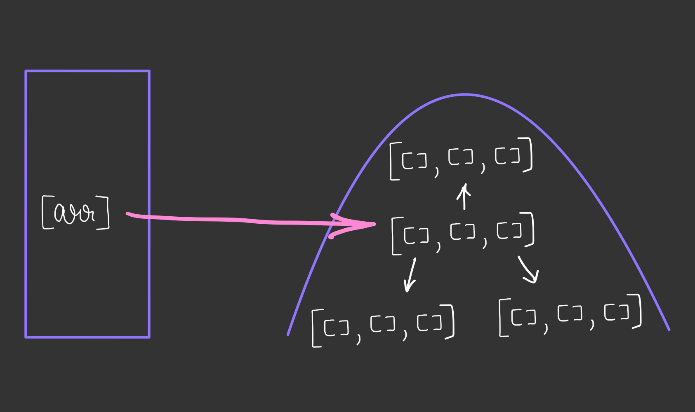

## Basic Functions in Java

```java
package com.inclass; 
 
public class Main { 
 
    public static void main(String[] args) { 
    System.out.println("Hey how are you?"); 
    } 
}
```

-   `package` shows the folder where the java files are present
    
-   `public` allows the class to be accessed from anywhere
    
-   `class` is name group of properties & functions
    
-   `Main` is file name of the java file
    
-   Generally to run the program java needs to make an object of “main’ class, `static` helps java to run the program without making an object
    
-   `main` is the entry point of the java program
    
-   `String[] args` is an array of strings which allows the command line arguments to get stored
    
-   `system` is class which consists of the basic functions
    
    "System.java" documentation :
    
    -   The `System` class contains several useful class fields and methods. It cannot be instantiated.
    -   Among the facilities provided by the `System` class are standard input, standard output, and error output streams; access to externally defined properties and environment variables; a means of loading files and libraries; and a utility method for quickly copying a portion of an array.
-   `out` is ready to accept data and display as output
    
    "out" function documentation :
    
    -   The `standard` output stream. This stream is already open and ready to accept output data.
    -   Typically this stream corresponds to display output or another output destination specified by the host environment or user.
-   `println` prints a string and then terminates the line
    
    "PrintStream.java" Documentation :
    
    -   A `PrintStream` adds functionality to another output stream, namely the ability to print representations of various data values conveniently.
    -   All characters printed by a `PrintStream` are converted into bytes using the given encoding or charset, or the platform's default character encoding if not specified. The `PrintWriter` class should be used in situations that require writing characters rather than bytes.

### How to run a java program ?

```bash
driptanil  driptanil-Lenovo-V110-15ISK  ~  javac Main.java
```

Converts .java file to .class file [ byte code ]

```powershell
driptanil  driptanil-Lenovo-V110-15ISK  ~  java Main
```

Runs the .class file

### Scanner

```java
import java.util.Scanner; 

Scanner input = new Scanner(System.in);
```

-   `scanner` is a simple text scanner which can parse primitive types and Strings using regular expressions.
    
    `Scanner.java` Documentation :
    
    -   A simple text scanner which can parse primitive types and strings using regular expressions.
    -   `Scanner` breaks its input into tokens using a delimiter pattern, which by default matches white-space. The resulting tokens may then be converted into values of different types using the various next methods.
-   `new` creates a new instance of a function or a class
    
-   `in` takes input from specially from keyboard or another source specified the user
    
    
    
    `InputStream` function Documentation :
    
    -   The `standard` input stream. This stream is already open and ready to supply input data. Typically this stream corresponds to keyboard input or another input source specified by the host environment or user

## Datatypes

### Primitives :

-   The datatypes, which cannot be further splitted into array of elements. E.g. integer, float, character, Boolean datatypes etc.
-   String is non primitive datatype

```java
byte b = 42; 
char c = 'a'; 
short s = 1024; 
int i = 50000; 
float f = 5.67f; 
double d = 0.1234;
```

### Typecasting :

Compressing a data type into a smaller data type explicitly.

```java
int a = 100; 
byte b = (byte) (a); 

Output : b = 100
```

### Automatic Type Promotion [in Java]

```java
byte a = 40; 
byte b = 50; 
byte c = 100; 
int d = a * b / c; 

/* Output : d = 20 */
```

Instead of operation with byte, whole operation is promoted to integer type

### Unicode

```java
int num = 'A'; 
System.out.println("ASCII of A = " + num); 

/* Output : ASCII of A = 65 */
```

```java
System.out.println("こんにちは"); 

/* Output : こんにち */
```

```java
byte b = 42; 
char c = 'a'; 
short s = 1024; 
int i = 50000; 
float f = 5.67f; 
double d = 0.1234; 
double result = (f * b) + (i / c) - (d * s); 
System.out.println("result = " + result); 

/* Output : result = 626.7784146484375 */
```

# ![[04-functions-methods]]
